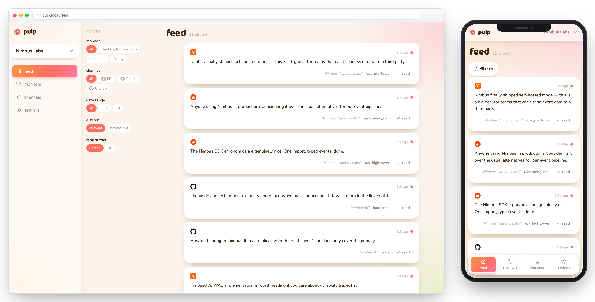

# Pulp

Self-hosted social listening: Pulp watches Hacker News, Reddit, and GitHub for
mentions of your product (or any keyword) and aggregates them into one feed,
with optional AI relevance filtering and push notifications.

<p align="center"></p>

**Single-tenant · Multi-workspace · No Docker required**

---

## Install

Prebuilt binaries for macOS, Linux, and Windows ship on every release — no
toolchain required.

```bash
# macOS / Linux
curl --proto '=https' --tlsv1.2 -LsSf https://github.com/crowecawcaw/pulp/releases/latest/download/pulp-installer.sh | sh
```

```powershell
# Windows
powershell -c "irm https://github.com/crowecawcaw/pulp/releases/latest/download/pulp-installer.ps1 | iex"
```

```bash
pulp serve   # → http://127.0.0.1:3000 (creates ~/.pulp/ on first run)
```

Prefer a double-click app? Signed installers (macOS `.dmg`, Windows `.msi`) with
a menu-bar/tray launcher are on the
[Releases page](https://github.com/crowecawcaw/pulp/releases).

---

## Quick start (CLI)

`pulp` is also a full CLI over the API — built for scripting and agents:

```bash
pulp seed                                                # demo data, no server needed
pulp query "nimbusdb" --channel hackernews --since 30d   # try keywords live, no server needed
pulp channels enable reddit
pulp monitors create "Nimbus" --term "Nimbus Labs" --channel reddit --channel hackernews
pulp mentions list --since 1d --unread
pulp --help                                              # full tour; --json everywhere
```

---

## Configuration

Runtime settings live in `~/.pulp/config.json`, editable from the **Settings**
page, the `pulp config` CLI, or env vars (highest precedence):

| Variable | Default | Purpose |
|----------|---------|---------|
| `PULP_HOME` | `~/.pulp/` | App home — config, database, VAPID keys |
| `BIND` | `127.0.0.1:3000` | Listen address |
| `RETENTION_DAYS` | _(unset)_ | Delete mentions older than N days |
| `PULP_LLM_BASE_URL` / `_MODEL` / `_API_KEY` | _(unset)_ | AI relevance filter endpoint |

### Channels

| Channel | Auth |
|---------|------|
| Hacker News | None |
| Reddit | None (public RSS search) |
| GitHub | Personal access token |

Configure on the **Channels** page, or `pulp channels set <channel> --credentials '{...}'`.

> No user authentication — the API and UI are open. Run behind your own network
> controls (VPN, reverse proxy, firewall) if exposed. For remote access and
> installing the PWA on iOS, put the box on a [Tailscale](https://tailscale.com)
> tailnet with HTTPS certificates enabled — `pulp serve` provisions a matching
> Let's Encrypt cert automatically.

### AI relevance filter (optional)

By default every mention matching a monitor's keywords reaches the feed. Give a
monitor an **AI filter prompt** and Pulp judges each new mention using any
OpenAI-compatible endpoint you bring — local (Ollama, LM Studio, vLLM) or
hosted (OpenAI, OpenRouter, …). Pulp ships no model itself.

```bash
pulp config set base_url http://localhost:11434/v1   # e.g. Ollama
pulp config set model qwen3.5:4b
pulp config set enabled true
pulp config test        # sends a sample mention end-to-end
```

---

## Architecture

Pulp is one Rust binary: a CLI wrapping a local Axum server backed by a single
SQLite file — no Postgres, no Docker. Background collector loops poll Hacker
News, Reddit, and GitHub into a shared per-workspace feed; an optional AI
filter judges relevance before a mention becomes visible; and a React web app —
installable as a PWA, with Web Push straight to your phone or desktop — reads
the feed over REST and SSE.

---

## Development

Requires Rust stable and Node 20+.

```bash
cd backend && cargo run -- serve            # → http://127.0.0.1:3000
cd frontend && npm install && npm run dev   # → http://localhost:5173 (proxies /api)

cd backend && cargo test
cd frontend && npm test
```

---

## Roadmap

- **Phase 1** ✅ — SQLite schema, CRUD APIs, HN + Reddit + GitHub collectors, feed + keyword UI
- **Phase 2** — Remaining collectors, alert dispatch, analytics charts
- **Phase 3** — Batch AI scoring pipeline, keyword suggestions
- **Phase 4** — MCP server adapter, one-click deploy buttons

---

## License

MIT
